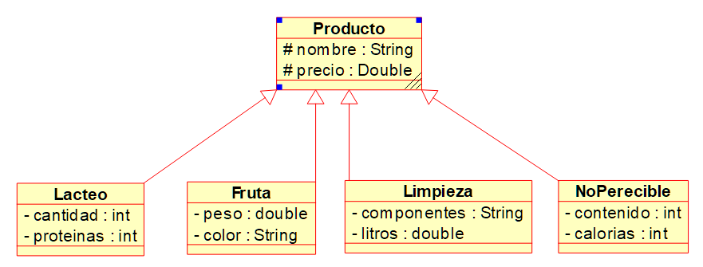

Para la tarea se pide implementar una clase llamada `BolsaSupermercado`
que maneje tipos genéricos para guardar productos en una lista de 
máximo 5 elementos. El tipo `List<T>` debe ser genérico, por ejemplo 
podríamos tener una bolsa que guarde productos de limpieza, otra 
bolsa para los lácteos otra para guardar frutas y otra para productos 
no perecibles.

La clase `BolsaSupermercado` debe tener solo dos métodos, uno para 
agregar los productos _addProducto_ cuyo argumento sea del tipo del
parámetro generic y el método _getProductos_ que devuelve la lista de 
productos del tipo generic.

Entonces como requerimiento vamos a tener 4 clases de productos 
`Fruta`, `Limpieza`, `Lacteo` y `NoPerecible`, todas tiene en común dos
atributos el _nombre_ (string) y _precio_ (double) que deben heredar de
la clase padre `Producto`, pero además cada una van a tener dos 
atributos propios adicionales, sus métodos getter y constructor 
para inicializar los 4 atributos (los 2 del padre y los 2 propios). 
Los atributos adicionales de cada clase se detalla en el siguiente 
diagrama de clase:

Para el ejemplo de la clase main se pide crear un objeto bolsa 
para cada tipo de producto con 5 elementos, se debe mostrar por 
cada bolsa el detalle completo de sus elementos, el precio,
nombre y los atributos adicionales sin realizar cast de ningún 
tipo, ni toString().

